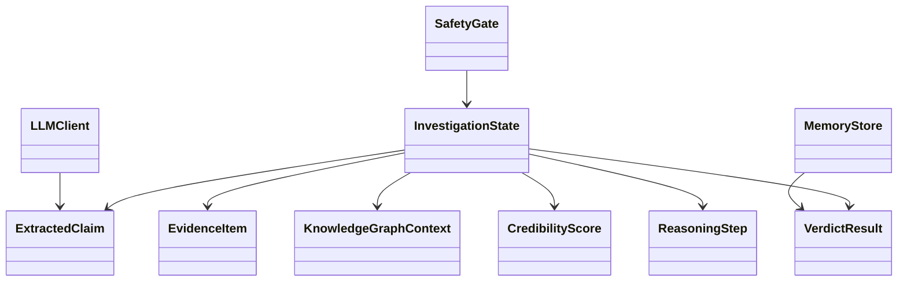

# Class map

```mermaid
classDiagram
  class SafetyGate
  class MemoryStore
  class LLMClient
  class InvestigationState
  class ExtractedClaim
  class EvidenceItem
  class KnowledgeGraphContext
  class CredibilityScore
  class ReasoningStep
  class VerdictResult
  SafetyGate --> InvestigationState
  MemoryStore --> VerdictResult
  LLMClient --> ExtractedClaim
  InvestigationState --> ExtractedClaim
  InvestigationState --> EvidenceItem
  InvestigationState --> KnowledgeGraphContext
  InvestigationState --> CredibilityScore
  InvestigationState --> ReasoningStep
  InvestigationState --> VerdictResult
```

Primary modules: `SafetyGate`, `MemoryStore`, `LLMClient`, six agent runners, hybrid fusion, Neo4j upsert, five MCP servers.
