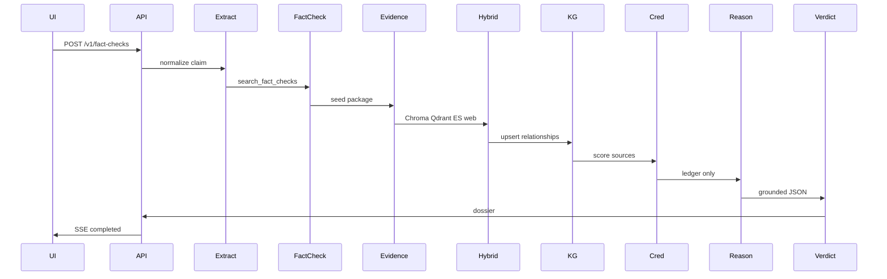

# Sequence

```mermaid
sequenceDiagram
  participant UI
  participant API
  participant Extract
  participant FactCheck
  participant Evidence
  participant Hybrid
  participant KG
  participant Cred
  participant Reason
  participant Verdict
  UI->>API: POST /v1/fact-checks
  API->>Extract: normalize claim
  Extract->>FactCheck: search_fact_checks
  FactCheck->>Evidence: seed package
  Evidence->>Hybrid: Chroma Qdrant ES web
  Hybrid->>KG: upsert relationships
  KG->>Cred: score sources
  Cred->>Reason: ledger only
  Reason->>Verdict: grounded JSON
  Verdict->>API: dossier
  API->>UI: SSE completed
```
